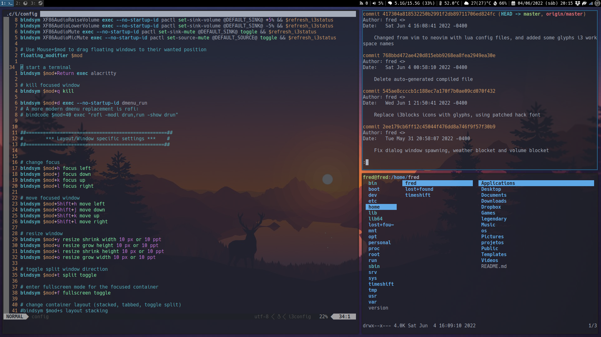

# Preview

# Config Dependencies

#### Most Packages should be available in the distro's standard repository

| Packages   |  Url  | Description |
| --------- | ----- | ----------- |
| 🗔  i3-gaps |[Github][1] | Fork of [i3 Window Manager][2] with gaps between the windows implemented |
| 🗖  i3blocks|[Github][3] | Status Bar for i3 |
|   picom   |[Github][4] | Compositor to make windows transparent |
| 🖵  zsh     |  | Highly customizable shell |
| 🖹  Neovim  |  | Highly customizable/extendable text editor|
| 🖽  Nitrogen|  | Background image manager |
| 🗛  Nerd Font (any) |[Github][5] | Patched fonts with glyphs of all popular fonts like font awesome and material design |
| 📰 Newsboat |[Github][6] | Terminal based rss feed |
| 🖴  Udiskie | | USB Automatic Mounter |

[1]: https://github.com/Airblader/i3
[2]: https://github.com/i3/i3
[3]: https://github.com/vivien/i3blocks
[4]: https://github.com/neovim/neovim
[5]: https://github.com/ryanoasis/nerd-fonts
[6]: https://github.com/newsboat/newsboat 

# Themes

- Zsh theme [Agnoster][7] (Needs a powerline font to work properly, any Nerd Font should work)
- Alacritty theme [One Dark Pro][8]

[7]: https://github.com/agnoster/agnoster-zsh-theme
[8]: https://github.com/eendroroy/alacritty-theme/blob/master/themes/one_dark.yaml 
